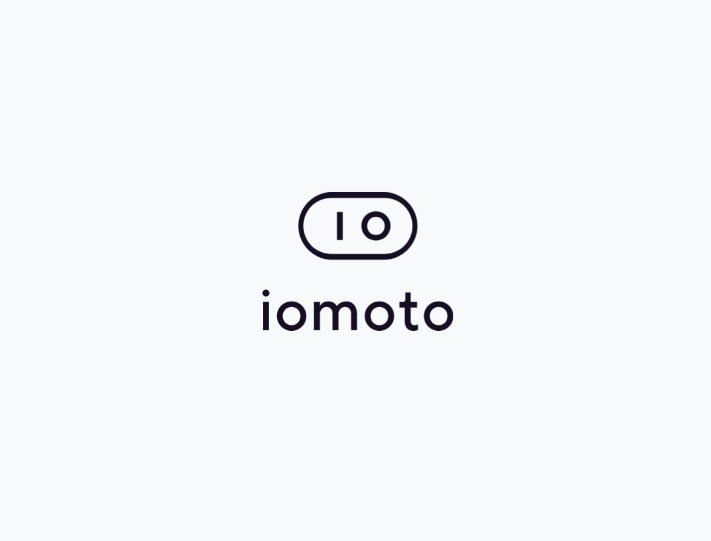
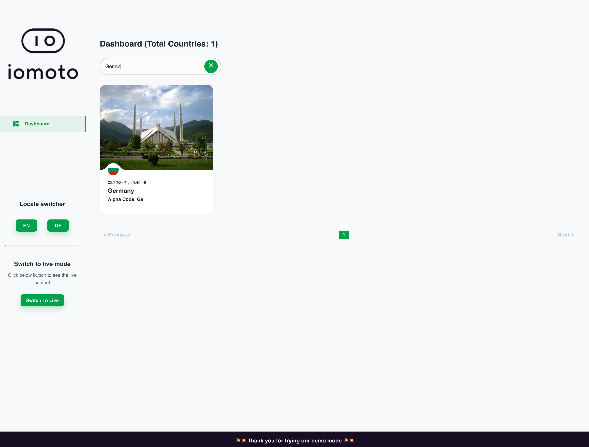
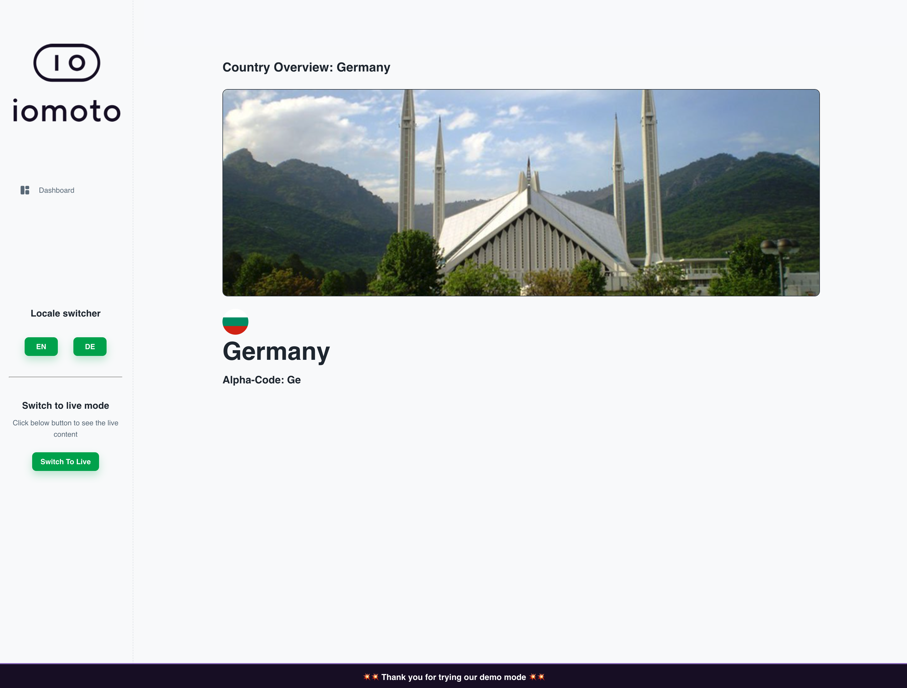
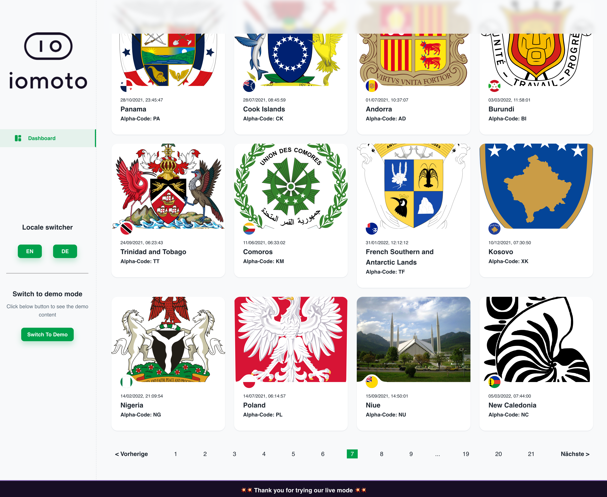
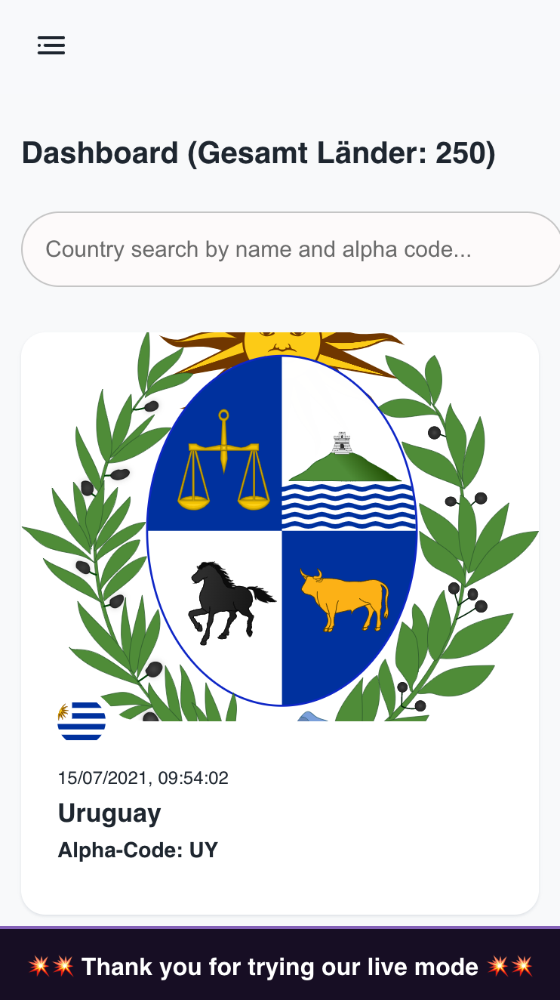
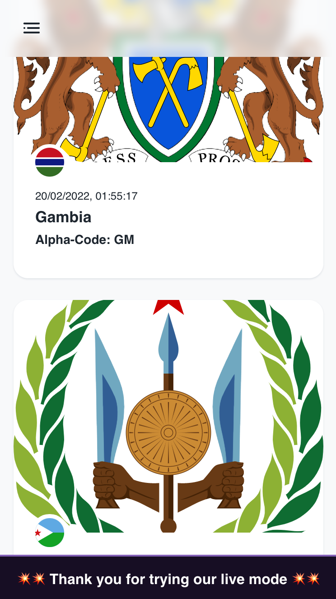
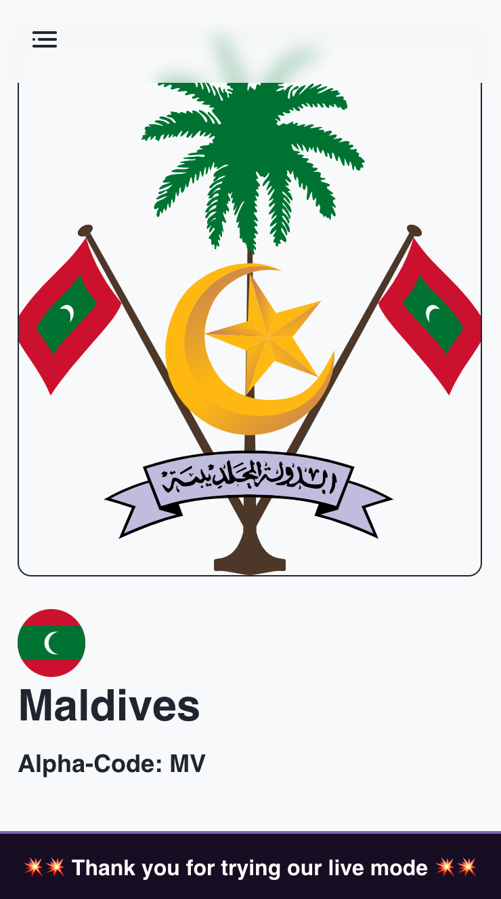

<div align="center" style="background: #ffffff; padding: 20px; margin-bottom: 20px">
  <a href="https://iomoto.io/">
    
  </a>
</div>

<div align="center">iomoto's Card Watch was developed especially with hauliers and fleet managers in mind.</div>

<br/>

<div align="center">
  <a href="https://www.npmjs.com/package/react">
    
  </a>
  <a href="https://iomoto.io/">
    
  </a>
  <a href="https://gitlab.com/dizzbo/frontend/web-homepage">
    
  </a>
  <a href="https://twitter.com/intent/follow?screen_name=storybookjs">
    
  </a>
</div>

<br />

[Iomoto](https://iomoto.io/) dashboard is a production ready application to visualize the list of countries and persisted search criteria.

# [LIVE DEMO](https://iomoto.vercel.app/)

## Table of contents

<hr />

- 🚀 [Getting Started](#getting-started)
- 👥 [Goal](#goal)
- 👏 [User Stories](#user-stories)
- 🛠 [Scenario](#scenario)
- 🌴 [Public API](#public-api)
- 💵 [Application Setup](#application-setup)
- 🛠️ [Tech Stack](#tech-stack)
- 🌴️ [Screenshots](#screenshots)

<a name="#getting-started"></a>

## 🚀 Getting Started

<hr />

The aim of this small project is to display and visualize the list of countries, and the data is been fetched from the [RestCountries API](https://restcountries.com/) 


<a name="#goal"></a>

## 📚 Goal

<hr />

Develop production-ready application for visualizing the list of countries which is available through the Public API.

Solution must include:

1. Render list of countries.
2. Consume restcountries API to get list of countries and render them with a pagination.
3. Possibility to filter countries based on the name and alpha code through a search field.
4. List should be populated based on the selection of search criteria.
5. The selection of country should be persisted between navigating to different pages.
6. Localization must also include in the project and english and german translations are only required.

Optionally, to make a dashboard more appealing, the below features should also be included:

- Proper templating and taking care of user experience.
- Added splash screen before directly jumping to the countries list for a smooth transition.
- Switch between live API data and a fake data using [@faker-js/faker](https://github.com/faker-js/faker) npm package.
- Responsive application for mobile, tab, and desktop.
- 70% test coverage also included
- Lazy loading also included while loading pictures

In order to save some times while working on this application, got some help from this project [Minimal UI Kit](https://minimal-kit-react.vercel.app/).


<a name="#user-stories"></a>

## 👏 User Stories

<hr />

- as a user, I want to see the list of countries published by RestCountries Public API.
- as a user, I want to filter countries based on search criteria and selection only works on the country name and alpha code.
- as a user, I want to persist the selection of countries while jumping on different pages.
- as a user, I want to switch between demo and live data.
- as a user, I want to see the localiized application


<a name="#scenario"></a>

## 🛠 Scenario

<hr />

1. 📥 Open iomoto dashboard on http://localhost:8080
2. Splash screen with smooth animation should appear 
3. Load countries retrieved from Public API in cards with some dummy data and cover image
4. On the dashboard page where countries listed, there must be a search field
5. Entering the name or alpha code of country populate countries accordingly
6. The search criteria also persists whether jumping on different screens
7. Clicking one of those card navigate to detail of country
8. Demo data can also be seen on just one button click from the left sidebar
9. Left sidebar also have locale switcher button in order to change locale between English and German


<a name="#public-api"></a>

## ☕ Public API

<hr />

List of endpoint can be found here [RestCountries API](https://restcountries.com/)

**Get list of countries**
```bash
GET https://restcountries.com/v3.1/all
```

<a name="#application-setup"></a>

## 🔥 Application Setup

<hr />

From installing packages to running the application locally or in a docker container, there is RUN.md file within this repo. Therefore, please refer to [RUN.md](RUN.md) file that describes how to start the project.


<a href="#tech-stack"></a>

## 🛠️ Tech Stack

<hr />

Currently, the following tech stack is being used for this specific project:

- **[React](https://reactjs.org)** - is used to develop this small project, and to learn more about it please refer to [React Getting Started](https://reactjs.org/docs/getting-started.html)
  

- **[Redux-Saga](https://redux-saga.js.org/)** - is used for the state management because it provides asynchronous approach of handling states, and due to its async behavior, Saga provides handling task concurrency. Read more about [Redux-Saga Getting Started](https://redux-saga.js.org/docs/introduction/GettingStarted)
  

- **[Material UI (MUI)](https://mui.com/)** = provides robust and customizable library of advanced React components. Learn more from here [Getting Started](https://mui.com/getting-started/installation/)
  

- **[Jest](https://jestjs.io/)** for Unit testing - is used for testing isolated code [Jest Guide](https://jestjs.io/docs/getting-started)
  

- **[Cypress](https://www.cypress.io)** for E2E testing - it covers a lot of aspects of end-to-end testing, and mostly frontend engineers recommend this tool for their UI pages and a complete flow. Recommending this guide to get into the world of E2E testing [Cypress Guide](https://docs.cypress.io/guides/overview/why-cypress)


- **[Context API](https://reactjs.org/)** context provides a way to pass data through the component tree without having to pass props down manually at every level. More details [React Context](https://reactjs.org/docs/context.html)


<a href="#screenshots"></a>

## Screenshots

<hr />

The screenshots of the application are as follows:

<table>
  <tr>
    <td>  </td>
    <td>  </td>
  </tr>
  <tr>
    <td>  </td>
    <td>  </td>
  </tr>
  <tr>
    <td>  </td>
    <td>  </td>
  </tr>
  <tr>
    <td>  </td>
    <td>  </td>
  </tr>
</table>
